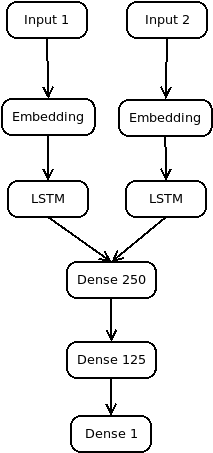

# Kaggle: Quora Question Pairs ([link](https://www.kaggle.com/c/quora-question-pairs/overview))

__Data__: 404 290 pairs of questions

__Task__: predict does a pair of questions have the same intent

__Evaluation__: Log Loss (Binary Cross-entropy)

__Solution__: simple multi-input LSTM-RNN using GloVe[[1]](https://nlp.stanford.edu/projects/glove/) word embeddings

__Success__: 0.385 Log Loss

